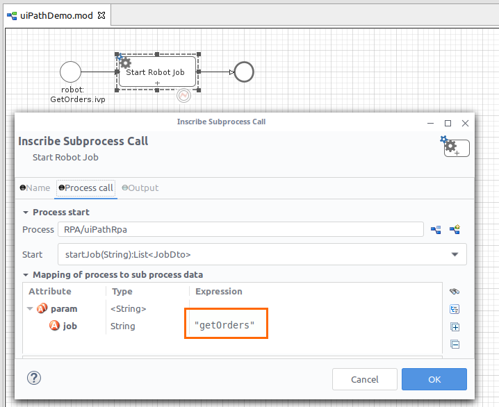
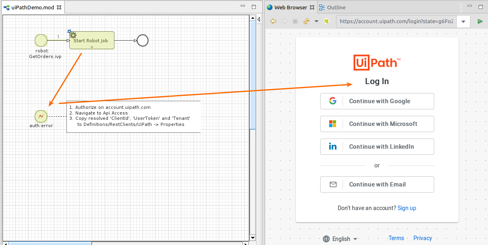
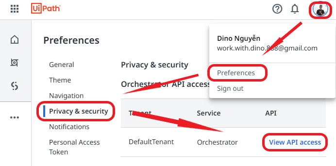
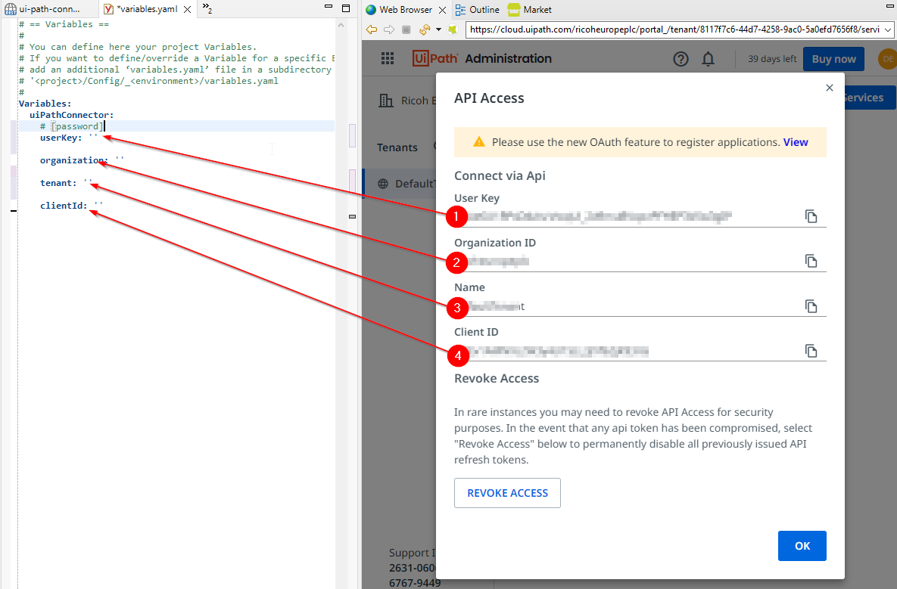
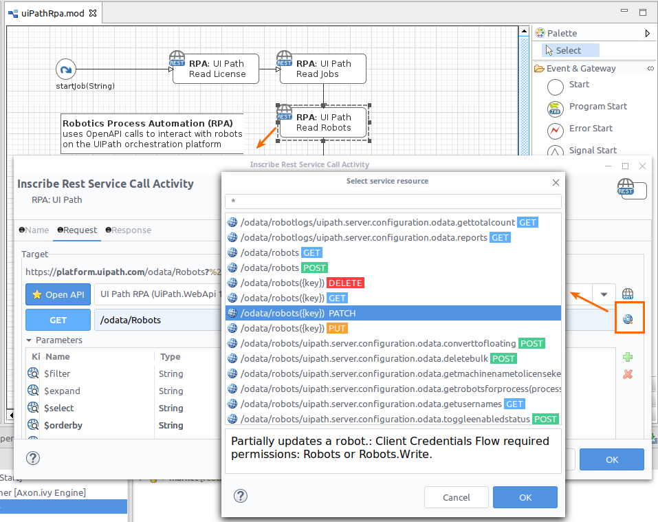

# UiPath-Konnektor
Der [UiPath](https://www.uipath.com/)-Konnektor von Axon Ivy hilft Ihnen dabei,
sich wiederholende manuelle Arbeitsschritte in älteren IT-Systemen zu
automatisieren und in Ihre Geschäftsprozesse zu integrieren.

Dieser Konnektor:

- ermöglicht es Ihnen, Roboterarbeiten aus Ihrem Arbeitsablaufprozess zu
  steuern.
- macht die Funktionen der UiPath RPA-API einfach und attraktiv für den Einsatz
  in Geschäftsprozessen.

## Demo

Mit diesem Konnektor wird ein Demo-Prozess installiert, um wichtige
Anwendungsfälle für UiPath Orchestrator-Interaktionen zu demonstrieren. Z. B.
„startAJob” auf einem unbeaufsichtigten Roboter.

## Einrichtung

Sicherheit ist wichtig! Der Datenfluss zwischen dem UiPath Orchestrator und der
Axon Ivy Engine ist verschlüsselt und durch OAUTH-Zugriffstoken geschützt.

Die Systeme müssen jedoch miteinander verbunden werden. Die Axon Ivy Engine
benötigt eine gültige clientId und userKey, die als Ersatz für Ihr Benutzerkonto
eine Verbindung zu UiPath herstellen dürfen.

Gehen Sie wie folgt vor:
1. Starten Sie einen beliebigen Prozess, der eine UiPath-Aktivitätsinteraktion
   enthält.
1. Wenn keine OAUTH-Anmeldedaten vorhanden sind, leitet der Browser Sie zur
   Anmeldeseite der UiPath-Cloud weiter.
   
1. Melden Sie sich an und navigieren Sie zu: Konto > Einstellungen > Datenschutz
   & Sicherheit > API-Zugriff anzeigen
   
1. Kopieren Sie die angezeigten `clientId`, `userKey` und `tenant` in Ihre Rest
   Client-Definition. 
1. Starten Sie den Vorgang erneut. Nun wird der AccessToken automatisch
   innerhalb der UiPath-Anfragen gesendet.

### Unbegrenzt

Obwohl sich die enthaltenen Demos auf prominente Anwendungsfälle konzentrieren,
sollten Sie beachten, dass unsere REST-Client-Aktivitäten die von UiPath
bereitgestellten APIs mit vollem Funktionsumfang nutzen können. Tatsächlich kann
alles mit geringem Programmieraufwand erledigt werden. Wählen Sie einfach eine
beliebige Servicemethode zum Aufrufen aus und verwenden Sie die intuitiven
Zuordnungstabellen, um Ihre Datenflüsse zu definieren.

Verwenden Sie den REST Client API-Browser, um sich einen ersten Überblick über
die Funktionen des UiPath Orchestrators zu verschaffen.

