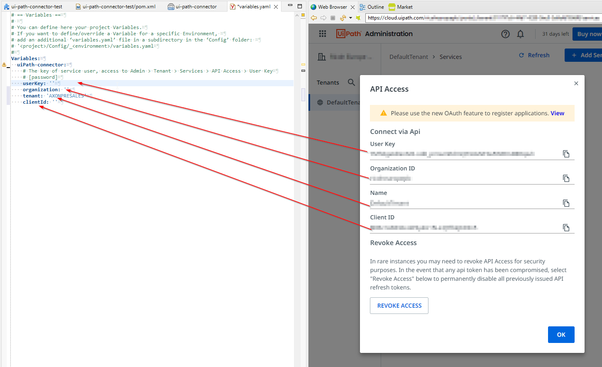

# UiPath Anschluss
#Axon Efeus [UiPath](https://www.uipath.com/) Anschluss hilft du zu
automatisieren monotone Handbuch Arbeit tritt ein Erben IT Systeme und
integrieren jene hinein eure dienstlichen Arbeitsgänge.

Dieser Anschluss:

- Aktiviert du zu #zusteuern #roboterhaft Arbeit von eure workflow Arbeitsgang.
- Macht das UiPath RPA API Charakterzüge leicht und charmant zu benutzen in
  dienstlich Arbeitsgänge.

## Demo

Mit diesem Anschluss ein Demo Arbeitsgang will sein installiert zu demonstrieren
prominente Nutzung Fälle für UiPath orchestrator Interaktionen. #Z.B.,
'startAJobs auf einem unbehandelten Roboter.

## Einrichtung

Sicherheit Angelegenheiten! #Daten Strömungen zwischen die UiPath Orchestrator
und der #Axon Efeu Motor ist #kodieren und geschützt mal OAUTH Zugang
Automatenmünzen.

Indes, die Systeme müssen sein hereingebracht zu #jede #andere. Der #Axon Efeu
Motor Notwendigkeiten ein gültiges clientId und userKey jener #dürfen koppelt zu
UiPath da Ersatz für eure Nutzer Konto.

Verfahr folgendermaßen:
1. Starte irgendwelchen Arbeitsgang jener zügelt einen UiPath Aktivität
   Interaktion.
1. Ob OAUTH #Berechtigungsnachweis sind nicht überreichen, der Browser wollen
   umleiten du zu der UiPath Wolke Anmeldung Seite.
   
1. Anmeldung und befahren zu: Konto > Präferenzen > Privatsphäre & Sicherheit >
   Ausblick API Zugang 
1. Kopier das gezeigt `clientId`, `userKey` und `Mieter` zu euren Rest Kunden
   Definition. 
1. Starte nochmal den Arbeitsgang. Jetzt das AccessToken wollen sein gesandt
   automatisch #innerhalb UiPath Bitten.

### Grenzenlos

Wobei das schloss ein Demos Fokus auf prominent Nutzung Fälle, seid bewusst dass
unser REST Kunde Aktivitäten können das volles benutzen geboten APIs jener ist
versehen mal UiPath. Eigentlich, es jede kann sein getan herein #blöken-Code
Art. Gerade auswählen irgendwelche Bedienung Methode zu rufen und benutzen die
intuitive Vermessung Tische zu definieren eure #Daten Strömungen.

Benutz den REST Kunden API Browser zu bekommen weiter einen ersten Umriss den
UiPath orchestrator Fähigkeiten.. 

